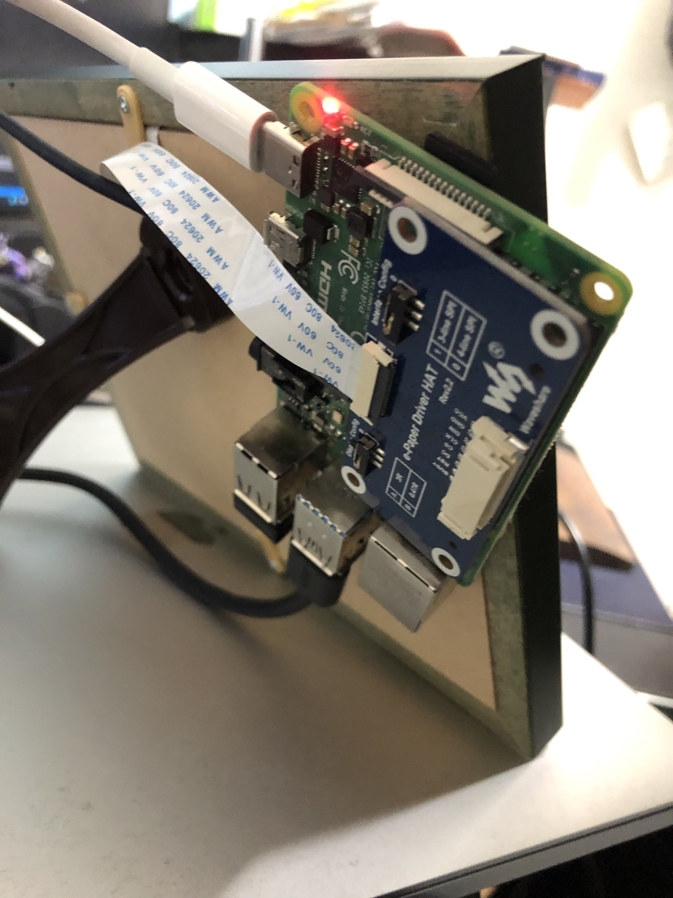
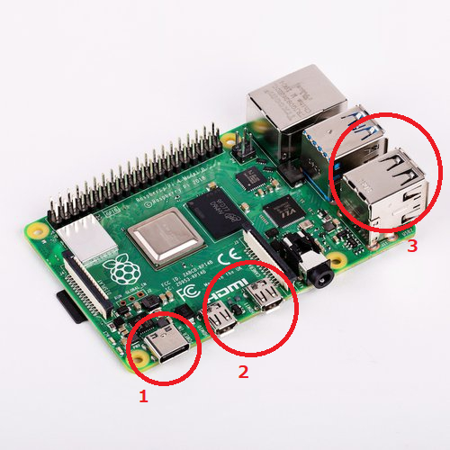
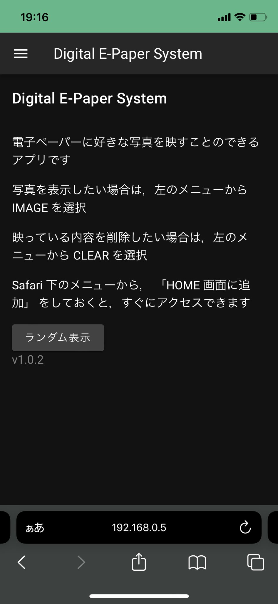
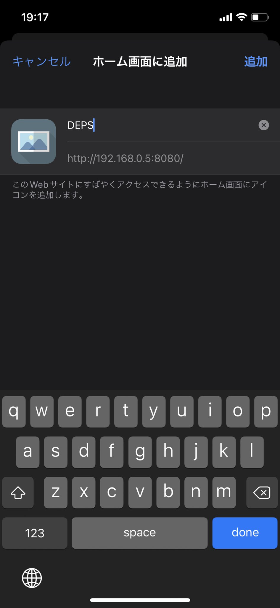
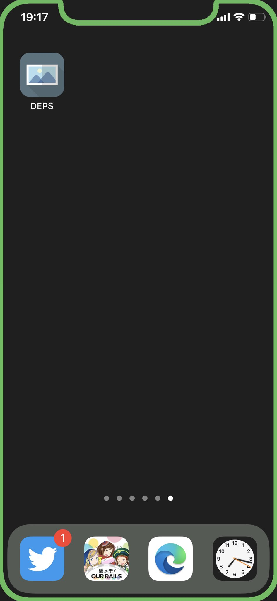

# 取扱説明書

# 目次

- 構成
- 初回起動時の操作方法
- 操作方法

# 構成

## 前面

## 背面

- 額縁の裏に Raspberry Pi 4 を固定

## 

1. 充電用ポート (USB Type-C)
2. 映像出力用ポート (mini HDMI)
3. マウス・キーボードなどその他の機器接続用ポート (USB Type-A)

# 初回起動時の操作方法

## Wi-Fi の設定

- 初めて使用する場合は，無線 LAN のセットアップが必要なため，マウス・キーボードを繋げて，画面出力をする
- 起動すると ↓ のようなデスクトップが表示される

- 右上のアイコンから Wi-Fi の設定が行える
- 自宅の SSID につなぐ

## 初めての起動

- 接続完了後，デスクトップにおいてある `IP.sh` を実行する (端末で実行を選択)
- IP アドレスが表示されるので，その IP の後ろに `:8080` をつけたものをスマートフォンの URL に打ち込む
  - 例: 表示された IP が `192.168.0.6` なら `192.168.0.6:8080` と入力
- ↓ のページが表示される

- Safari のメニューから，ホーム画面に追加を選択

- ホーム画面に追加され，次回からはこのアイコンをタップして起動できる

- 次回以降は，電源だけ接続すれば起動できる
  - モバイルバッテリーでも ok
  - 挿しっぱなしでも使えるスイッチ式の延長ケーブルも付属

# 操作方法

- 左上のメニューボタンをタップか，画面下のアイコンをタップすると，各ページに移動できる

## 目次

- HOME
- CLEAR
- UPLOAD
- IMAGE
- GOOGLE PHOTOS
- SETTINGS
- USAGE

## HOME

- トップページ
- `ランダム表示` ボタンをタップすると，保存されている写真からランダムに出力する
- たまに起動時にアップデートを促す通知が表示されるかも...?

## CLEAR

- 電子ペーパーの表示を白紙に戻したいときに使用する

## UPLOAD

- スマートフォンのカメラで撮影した写真を表示したい場合に使用する
- 写真選択後は，電子ペーパーに出力する範囲をトリミングしたり，以下の操作を行える
  - 時計回りに回転
  - 保存 (IMAGE のページで使用できる)
  - アップロードする (電子ペーパーに出力する)

## IMAGE

- 過去に電子ペーパーに表示して，保存した内容をもう一度映したいときに使用する
- 写真を選ぶと， UPLOAD と同様の画面になるので，そのまま出力したり，再度トリミングしたりできる
  - 削除 を押すと，IMAGE の一覧から削除され，ランダム表示でも出力されなくなる

## GOOGLE PHOTOS

- Google Photos で共有しているアルバムの一覧が表示される
- アルバムを選択すると，そのアルバムの画像一覧が表示される
- 画像を選択すると，その画像を操作して電子ペーパーに出力する事ができる
  - 保存は， IMAGE に保存される
  - お気に入りに登録は一覧で ★ マークが付くようになる (お気に入りをまとめるような機能は未実装)

## SETTINGS

- 設定項目を操作することができる
- `起動時にランダム表示`
  - 電源を起動した際に，ランダム表示を実行する
    - IMAGE に保存されている画像から 1 枚ランダムに出力する
    - 電源入れるだけで何かが表示されるようになるのでおすすめ
- `IP変更後の起動時に通知する`
  - 無線 LAN で接続した IP アドレスは，不定期で変更されることがある
  - IP アドレスが変更されていると，ホーム画面に追加したアイコンから起動することができず，新しい IP アドレスをブラウザで打ち直す必要がある
    - この設定をオンにしていると，新しい IP アドレスが電子ペーパーに表示されるので，改めて初期設定のようにマウスなどをつないで確認する手間が省ける

## USAGE

- 取扱説明書をダウンロードできる
